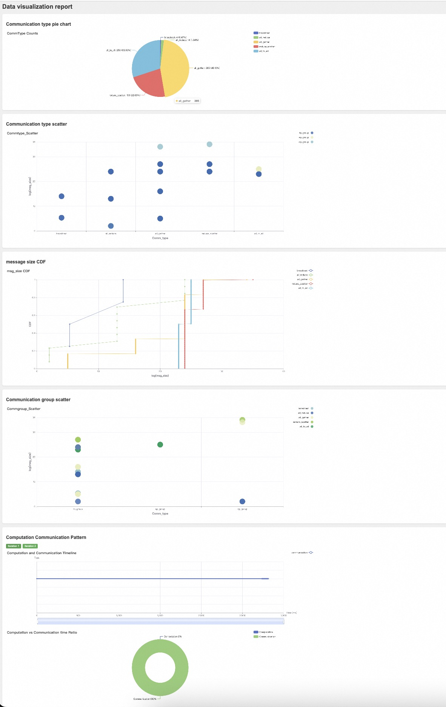

# Access AICB  
You can access the full suite of **SimAI** tools on **GitHub** via  [**SimAI@github**](https://github.com/aliyun/SimAI)  
你可以通过 [**SimAI@github**](https://github.com/aliyun/SimAI) 在 GitHub 上访问完整的 **SimAI** 工具套件。

You can access AICB on **GitHub** via  [**AICB@github**](https://github.com/aliyun/aicb)  
你可以通过 [**AICB@github**](https://github.com/aliyun/aicb) 在 GitHub 上访问 AICB。

You can also access AICB on **Gitee** via [**AICB@gitee**](https://gitee.com/ali-ais-hpn/aicb)  
你也可以通过 [**AICB@gitee**](https://gitee.com/ali-ais-hpn/aicb) 在 Gitee 上访问 AICB。

Welcome to join the SimAI community chat groups, with the DingTalk group on the left and the WeChat group on the right.  
欢迎加入 SimAI 社区聊天群，左侧为钉钉群，右侧为微信群。

<div style="display: flex; justify-content: flex-start; align-items: center; gap: 20px; margin-left: 20px;">  
      
    # 显示钉钉群二维码的图片，宽度为300像素。  
      
    # 显示微信群二维码的图片，宽度为300像素。  
</div>  

<br/>  
添加一个空行，用于格式美化。

# Lastest News  
[2024/9] AICB Version 1.1 Released.  
最新新闻  
[2024/9] AICB 版本1.1 发布。

This version brings the following changes:  
该版本带来了以下变化：

Features  
功能新增  
1. Added result visualization functionality, which supports displaying results after physical cluster runs and also supports visualization of generated workload files. For details, see the Readme.  
 增加了结果可视化功能，支持在物理集群运行后显示结果，并支持生成工作负载文件的可视化。详情请参阅 Readme。  
2. Optimized the method for dividing communication groups, enhancing scalability.  
 优化了通信组的划分方法，增强了可扩展性。  
3. Added support for the AIOB computation pattern for moe group_gemm.  
 增加了对 moe group_gemm 的 AIOB 计算模式的支持。  
4. Made some optimizations to the run_in_cluster script.  
 对 run_in_cluster 脚本进行了部分优化。

Bug Fixes  
 Bug 修复  

1. Fixed some calculation errors of BusBw in the log.  
 修复了日志中 BusBw 的一些计算错误。  
2. Fixed abnormal computation time issues with AIOB during multi-machine runs.  
 修复了 AIOB 在多机运行时的计算时间异常问题。  
3. Fixed anomalies in comm_log statistics when computation_enable is on.  
 修复了启用 computation_enable 时 comm_log 统计中的异常问题。  
4. Fixed potential hangs in the `run_suite` script.  
 修复了 `run_suite` 脚本可能挂起的问题。  
5. Fixed errors in generating simAI workload description files when using `tp=1`, `ep=1`.  
 修复了在使用 `tp=1` 和 `ep=1` 时生成 simAI 工作负载描述文件的错误。  
6. Fixed some msg size errors related to moe.  
 修复了与 moe 相关的一些消息大小错误。

 Table of Contents  
- [Access AICB](#access-aicb)  
- [Lastest News](#lastest-news)  
- [Table of Contents](#table-of-contents)  
- [AICB Overview](#aicb-overview)  
  - [Introduction](#introduction)  
  - [The benchmark suite in AICB](#the-benchmark-suite-in-aicb)  
- [Setup](#setup)  
- [Usage](#usage)  
  - [Running on physical GPU clusters](#running-on-physical-gpu-clusters)  
    - [Basic parameters that you need to set](#basic-parameters-that-you-need-to-set)  
    - [Running the whole benchmark suite](#running-the-whole-benchmark-suite)  
    - [Running workloads for Megatron](#running-workloads-for-megatron)  
    - [Running workloads for MOE](#running-workloads-for-moe)  
    - [Running workloads for DeepSpeed](#running-workloads-for-deepspeed)  
    - [Embedding the compuation patterns in the workload](#embedding-the-compuation-patterns-in-the-workload)  
  - [Generate Workloads for Simulation (SimAI)](#generate-workloads-for-simulation-simai)  
    - [Generating the workload description files for the whole benchmark suite](#generating-the-workload-description-files-for-the-whole-benchmark-suite)  
    - [Generating the workload description files for Megatron](#generating-the-workload-description-files-for-megatron)  
    - [Generating the workload description files for Moe](#generating-the-workload-description-files-for-moe)  
    - [Generating the workload description files for DeepSpeed](#generating-the-workload-description-files-for-deepspeed)  
  - [Running AICB with customized parameters](#running-aicb-with-customized-parameters)  
    - [Running customized workloads on physical GPU clusters](#running-customized-workloads-on-physical-gpu-clusters)  
    - [Generating customized workload description files](#generating-customized-workload-description-files)  
  - [Result Visualization](#result-visualization)  
     结果可视化部分的目录。  
- [Tutorial](#tutorial)  
- [Projects using AICB](#projects-using-aicb)  

# AICB Overview  
## Introduction  
AICB (Artificial Intelligence Communication Benchmark), is a novel benchmark suite for evaluating the communication system of a realistic and emulated GPU cluster from the pespectives of the emerging training and inference applications.  
 AICB（人工智能通信基准测试）是一个新型的基准测试套件，用于从新兴的训练和推理应用的角度评估现实和仿真GPU集群的通信系统。

Different from exisiting network benchmarks, AICB is designed to produce the communication workloads with precise patterns that are aligned to real-world applications.  
 与现有的网络基准测试不同，AICB 旨在生成与真实应用对齐的精确模式的通信工作负载。

Taking the Large Language Model (LLM) training as an example, the workloads vary with the complicated combinations of models, parallel frameworks, and parameters of the models, parallel frameworks, and the collective communication libraries.  
 以大语言模型（LLM）训练为例，工作负载会随着模型、并行框架及其参数和集体通信库的复杂组合而变化。

In general, the scenarios suitable for using AICB include but not limited to 1) benchmarking and tuning of the communication system of a GPU cluster, 2) investigating and analyzing the communication patterns of specific application settings, 3) tools, e.g. simulators, that need workloads which are well described.  
 通常，适用于 AICB 的场景包括但不限于：1）GPU 集群通信系统的基准测试和调优；2）研究和分析特定应用设置的通信模式；3）需要良好描述工作负载的工具，例如仿真器。

## The benchmark suite in AICB  
There are a lot of parameters that influence the communication and computation patterns, which are (1) model parameters (e.g., hidden_size, num_layers, seq_len, etc.) and (2) framework parameters (e.g., world size, parallelization strategies (TP, PP, DP, SP), zero level, reduce_bucket_size/allgather_bucket_size, etc.).  
 AICB 中的基准测试套件  
 有许多参数会影响通信和计算模式，包括：  
 1）模型参数（如 hidden_size、num_layers、seq_len 等）；  
 2）框架参数（如 world size、并行化策略 (TP、PP、DP、SP)、zero level、reduce_bucket_size/allgather_bucket_size 等）。

For the sake of generality, we cover those typical settings using a smallest set of benchmarks rather than traversing all the combinations.  
 为了实现通用性，我们使用一组最小的基准测试覆盖这些典型设置，而不是遍历所有组合。

To this end, we propose the benchmark suite as listed in the following table.  
 为此，我们提出了如下表所列的基准测试套件。

**Users can directly run all the selected workloads selected in AICB, or run part of the workloads, or even generate their own workloads.**  
 用户可以直接运行AICB中选择的所有工作负载，或只运行其中一部分工作负载，甚至生成自己的工作负载。

For more detailed information, please refer to [AICB_workload spec v1.1](workload/Workload_spec_v1.1.csv).  
 更多详细信息，请参阅 [AICB_workload spec v1.1](workload/Workload_spec_v1.1.csv)。
| id  | Name          | Sequence_length | Framework | TP  | DP                    | PP  | SP     | Expert parallel number | Expert num | Zero_level |
|:---:|:-------------:|:---------------:|:---------:|:---:|:---------------------:|:---:|:------:|:----------------------:|:----------:|:----------:|
|  1  | LLaMA_7B      |      2048       | Megatron  |  1  |  world_size/(PP*TP)   |  1  |   -    |           -            |     -      |     -      |
|  2  | GPT_13B       |      2048       | Megatron  |  2  |  world_size/(PP*TP)   |  1  | enable |           -            |     -      |     -      |
|  3  | GPT_22B       |      2048       | Megatron  |  4  |  world_size/(PP*TP)   |  1  |   -    |           -            |     -      |     -      |
|  4  | LLaMA_65B     |      4096       | Megatron  |  8  |  world_size/(PP*TP)   |  2  | enable |           -            |     -      |     -      |
|  5  | GPT_175B      |      2048       | Megatron  |  8  |  world_size/(PP*TP)   |  8  | enable |           -            |     -      |     -      |
|  6  | GPT_175B      |      2048       | Megatron  |  8  |  world_size/(PP*TP)   |  8  | disable|           -            |     -      |     -      |
|  7  | Llama3_405B   |      8192       | Megatron  |  8  |  world_size/(PP*TP)   |  16 | enable |           -            |     -      |     -      |
|  8  | LLaMA_7B      |      4096       | Deepspeed |  1  |      world_size       |  1  |   -    |           -            |     -      |     2      |
|  9  | LLaMA_65B     |      4096       | Deepspeed |  1  |      world_size       |  1  |   -    |           -            |     -      |     3      |
| 10  | Mistral_8*7B  |      2048       | Megatron  |  2  |  world_size/(PP*TP)   |  1  | enable |           8            |     8      |     -      |


# Setup  
 设置  
You can follow the instrucitons below to quickly set up the environtments and run AICB.  
 你可以按照下面的说明快速设置环境并运行 AICB。

1. Installation from source code  
 1. 从源代码安装  

    a. To initiate actual communication tasks, ensure that the runtime environment has all necessary dependencies, such as CUDA and [PyTorch](https://pytorch.org), already installed. For specific usage examples, see [Physical Execution](#physical-execution)  
     为了启动实际的通信任务，确保运行时环境已经安装了所有必要的依赖项，如 CUDA 和 [PyTorch](https://pytorch.org)。具体使用示例请参阅 [物理执行](#physical-execution)。

    b. To generate workload traffic patterns for large model parallel framework training, you can use a CPU-only environment. For specific usage examples, see [Generate Workloads ](#generate-workloads )  
     要为大模型并行框架训练生成工作负载流量模式，你可以使用仅 CPU 环境。具体使用示例请参阅 [生成工作负载](#generate-workloads)。

2. Installation from deb package (for Ubuntu systems)  
 2. 从 deb 包安装（适用于 Ubuntu 系统）  

    Currently, you can install the deb package  on an NV-built NGC container [NGC's PyTorch container](https://ngc.nvidia.com/catalog/containers/nvidia:pytorch) to start running AICB.  
     目前，你可以在由 NV 构建的 NGC 容器中安装 deb 包 [NGC 的 PyTorch 容器](https://ngc.nvidia.com/catalog/containers/nvidia:pytorch) 来开始运行 AICB。  

    ```bash
    docker pull nvcr.io/nvidia/pytorch:xx.xx-py3
    docker run --gpus all -it --rm -v /path/to/AICBench:/workspace/AICBench nvcr.io/nvidia/pytorch:xx.xx-py3
    dpkg -i /download/AICB_v1.0.deb 
    sh megatron_workload_with_aiob.sh -m 7
    ```

    ```bash  
    docker pull nvcr.io/nvidia/pytorch:xx.xx-py3  
    # 拉取指定版本的 PyTorch 镜像  
    docker run --gpus all -it --rm -v /path/to/AICBench:/workspace/AICBench nvcr.io/nvidia/pytorch:xx.xx-py3  
    # 启动 Docker 容器，挂载 AICBench 目录，并启用 GPU  
    dpkg -i /download/AICB_v1.0.deb  
    # 安装 AICB deb 包  
    sh megatron_workload_with_aiob.sh -m 7  
    # 执行脚本来启动指定的工作负载  
    ```  

3. Composing a Docker image from Dockfile  
 3. 从 Dockerfile 创建 Docker 镜像  

    You can launch an instance of the Docker container  with Dockerfile for quick start:  
     你可以通过 Dockerfile 快速启动一个 Docker 容器实例：  

    ```bash  
    docker build -t image:latest .  
    # 根据 Dockerfile 构建 Docker 镜像  
    docker run --gpus all -it --rm image:latest  
    # 启动构建的 Docker 容器，启用 GPU  
    ```  

    ```bash
    docker build -t image:latest .
    docker run --gpus all -it --rm image:latest 
    ```

 Usage  
 使用  
After installation, we provide three main usage scenarios for AICB:  
 安装后，我们提供了三种主要的 AICB 使用场景：  

1. [Running on physical GPU clusters](#running-on-physical-gpu-clusters)  
 1. [在物理 GPU 集群上运行](#running-on-physical-gpu-clusters)  

2. [Generating workload descrption files for simulation](#generate-workloads-for-simulation-simai)  
 2. [为仿真生成工作负载描述文件](#generate-workloads-for-simulation-simai)  

3. [Customized parameters](#customized-parameters).  
 3. [自定义参数](#customized-parameters)。

There is a tutorial including all the details, please refer to [the tutorial](training/tutorial.md).  
 这里有一个包括所有细节的教程，请参阅 [教程](training/tutorial.md)。

## Running on physical GPU clusters  
 在物理 GPU 集群上运行  
For running AICB on a physical machine, we provide both [scripts](scripts/megatron_gpt.sh) for quick start and [methods](aicb.py) for executing custom cases.  
 在物理机器上运行 AICB，我们提供了 [脚本](scripts/megatron_gpt.sh) 以便快速启动，以及 [方法](aicb.py) 以便执行自定义案例。

### Basic parameters that you need to set  
 需要设置的基本参数  
When running on a physical machine, additional configuration of environment variables required by PyTorch is necessary.  
 在物理机器上运行时，需要额外配置 PyTorch 所需的环境变量。  
```bash
--nnodes                  Number of nodes: $WORLD_SIZE
--node_rank               Rank of the node: $RANK
--nproc_per_node          Number of GPUs per node: $NUM_GPUS
--master_addr             Master address: $MASTER_ADDR
--master_port             Master port: $MASTER_PORT
```

```bash  
--nnodes                  Number of nodes: $WORLD_SIZE  
# --nnodes 指定节点数：$WORLD_SIZE  
--node_rank               Rank of the node: $RANK  
# --node_rank 指定节点排名：$RANK  
--nproc_per_node          Number of GPUs per node: $NUM_GPUS  
# --nproc_per_node 指定每个节点的 GPU 数量：$NUM_GPUS  
--master_addr             Master address: $MASTER_ADDR  
# --master_addr 指定主节点地址：$MASTER_ADDR  
--master_port             Master port: $MASTER_PORT  
# --master_port 指定主节点端口：$MASTER_PORT  

### Running the whole benchmark suite  
# 运行完整的基准测试套件  
You can directly execute all the test cases provided in our AICB workload specification v1.0 in physical GPU cluster by utilizing the [run_suites](run_suites.py) script.  
# 你可以通过 [run_suites](run_suites.py) 脚本直接在物理 GPU 集群上执行 AICB 工作负载规范 v1.0 中提供的所有测试用例。  

This script ensures that all parallel framworks are covered, allowing you to validate and analyze the performance and behavior of various workloads efficiently.  
# 该脚本涵盖了所有并行框架，允许你高效地验证和分析各种工作负载的性能和行为。  

### Running workloads for Megatron  
# 运行 Megatron 工作负载  
For the `Megatron parallel framework`, you can quickly start using the scripts/megatron_gpt.sh script file.  
# 对于 `Megatron 并行框架`，你可以使用脚本文件 scripts/megatron_gpt.sh 快速启动。  

```bash  
sh scripts/megatron_gpt.sh \  
# 执行 Megatron 启动脚本  

--nnodes 1 --node_rank 0 --nproc_per_node 8 --master_addr localhost --master_port 29500 \  
# 设置节点数（1）、节点排名（0）、每节点 GPU 数（8）、主节点地址（localhost）和主节点端口（29500）  

-m 7 --world_size 8 --tensor_model_parallel_size 2 --pipeline_model_parallel 1 \  
# 设置模型 ID（7）、集群大小（8）、张量并行大小（2）、流水线并行大小（1）  

--frame Megatron --global_batch 16  \  
# 设置框架为 Megatron，全局批量大小为 16  

--micro_batch 1 --seq_length 2048 --swiglu --use_flash_attn --aiob_enable  
# 设置微批量大小为 1，序列长度为 2048，启用 swiglu 和 flash_attn，并启用 AIOB 功能
```

```bash
sh scripts/megatron_gpt.sh \
--nnodes 1 --node_rank 0 --nproc_per_node 8 --master_addr localhost --master_port 29500 \
-m 7 --world_size 8 --tensor_model_parallel_size 2 --pipeline_model_parallel 1 \
--frame Megatron --global_batch 16  \
--micro_batch 1 --seq_length 2048 --swiglu --use_flash_attn --aiob_enable
```

### Running workloads for MOE
运行 MOE 工作负载
For Moe, you can quickly start it using the scripts/megatron_gpt.sh script file.
对于 Moe，你可以使用脚本文件 scripts/megatron_gpt.sh 快速启动。

```bash
sh scripts/megatron_gpt.sh \
--nnodes 1 --node_rank 0 --nproc_per_node 8 --master_addr localhost --master_port 29500 \
-m moe --world_size 8 --tensor_model_parallel_size 4 --pipeline_model_parallel 1 \
--moe_enable --expert_model_parallel_size 1  \
--frame Megatron --global_batch 16  \
--num_experts 4 --moe_router_topk 2 \
--micro_batch 1  --sp --grouped_gemm --aiob_enable --swiglu --use_flash_attn 
```

sh scripts/megatron_gpt.sh \  
 执行 MOE 启动脚本  
--nnodes 1 --node_rank 0 --nproc_per_node 8 --master_addr localhost --master_port 29500 \  
 设置节点数（1）、节点排名（0）、每节点 GPU 数（8）、主节点地址（localhost）和主节点端口（29500）  
-m moe --world_size 8 --tensor_model_parallel_size 4 --pipeline_model_parallel 1 \  
 设置模型为 MOE，集群大小为 8，张量并行大小为 4，流水线并行大小为 1  
--moe_enable --expert_model_parallel_size 1  \  
 启用 MOE，并设置专家模型并行大小为 1  
--frame Megatron --global_batch 16  \  
 设置框架为 Megatron，全局批量大小为 16  
--num_experts 4 --moe_router_topk 2 \  
 设置专家数量为 4，MOE 路由器 top-k 为 2  
--micro_batch 1  --sp --grouped_gemm --aiob_enable --swiglu --use_flash_attn  
 设置微批量大小为 1，启用 SP、分组 GEMM、AIOB 功能，以及 swiglu 和 flash_attn  


### Running workloads for DeepSpeed 
运行 DeepSpeed 工作负载
For the `DeepSpeed` parallel framework, you can quickly start it using the [scripts/deepspeed_llama.sh](scripts/deepspeed_llama.sh) script file. Currently, the DeepSpeed framework does not support `--aiob_enable` or `--comp_filepath`, but you can choose to use fixed computation times (please refer to [the tutorial](training/tutorial.md)).
对于 DeepSpeed 并行框架，你可以使用脚本文件 scripts/deepspeed_llama.sh 快速启动。 当前 DeepSpeed 框架不支持 --aiob_enable 或 --comp_filepath，但你可以选择使用固定的计算时间（请参阅 教程）。

```bash
sh scripts/deepspeed_llama.sh \
--zero_stage 3 -m 65 --epoch_num 100 \
--reduce_bucket_size=1000000000 --allgather_bucket_size=500000000 \
--param_persistence_threshold=1000000 \
```

sh scripts/deepspeed_llama.sh \  
 执行 DeepSpeed 启动脚本  
--zero_stage 3 -m 65 --epoch_num 100 \  
 设置零优化阶段为 3，模型大小为 65，训练轮数为 100  
--reduce_bucket_size=1000000000 --allgather_bucket_size=500000000 \  
 设置 reduce 桶大小为 1G，allgather 桶大小为 500M  
--param_persistence_threshold=1000000 \  
 设置参数持久性阈值为 1M  


### Embedding the compuation patterns in the workload
将计算模式嵌入到工作负载中
To mirror the real-world workloads with both computation and communicaiton, we developed a sub-module, AIOB, that is used to generate computation patterns.
为了模拟包含计算和通信的真实工作负载，我们开发了一个名为 AIOB 的子模块，用于生成计算模式。
In AICB, we can enable AIOB to embed the computation time into the workloads.
在 AICB 中，我们可以启用 AIOB 将计算时间嵌入到工作负载中。

 对于 Megatron 并行框架，`--aiob_enable` 选项允许捕获实际模型中每个操作的计算时间。
For the Megatron parallel framework, the `--aiob_enable` option allows for capturing the computation time of each operation in the actual model. 

 如果我们不设置 `--aiob_enable`，则只能应用固定的计算时间。（详见 [教程](training/tutorial.md)）
If we do not set `--aiob_enable`, only fixed computation times can be applied. (Please refer to [the tutorial](training/tutorial.md))

 使用 AIOB 生成的计算时间运行工作负载。
* Running workloads with computation times generated by AIOB. 
 运行后，我们可以在 [results/aiob_outputs](results/aiob_outputs) 目录中获得一个额外的计算描述文件，描述主要计算内核的计算时间。
After running, we can get an extra computation desrcription file describing the computation times for the main computation kernels in the directory of [results/aiob_outputs](results/aiob_outputs). 
 注意，这些计算时间是通过在特定 GPU 上执行计算内核获得的。
Note that the computation times are obtained through the execution of computation kernels on the specific GPU. 
 以下命令不仅运行了实际 GPU 集群上的工作负载，还生成了计算描述文件。
The following commands does not generate the computation descrition file, but also run the workload in the real GPU cluster.

```bash
sh scripts/megatron_gpt.sh \  # 调用脚本运行 Megatron 工作负载
-m 7 --world_size 8 --tensor_model_parallel_size 2 --pipeline_model_parallel 1 \  
# 设置模型为 7，集群大小为 8，张量并行大小为 2，流水线并行大小为 1
--frame Megatron --global_batch 16  \  # 设置框架为 Megatron，全局批量大小为 16
--micro_batch 1 --seq_length 2048 \  # 设置微批量大小为 1，序列长度为 2048
--swiglu --use_flash_attn  --aiob_enable  # 启用 swiglu 和 flash_attn，开启 AIOB 功能
```

```bash
sh scripts/megatron_gpt.sh \
-m 7 --world_size 8 --tensor_model_parallel_size 2 --pipeline_model_parallel 1 \
--frame Megatron --global_batch 16  \
--micro_batch 1 --seq_length 2048 \
--swiglu --use_flash_attn  --aiob_enable 
```
* 通过已有的计算描述文件运行工作负载。
Running workload with computation time through an existing computation decription file.
用户可以定义自己的计算时间，或直接使用我们提供的文件。
Users can defined their own computation times or directly use the files we provided.
通过使用 --comp_filepath 选项指定计算描述文件，可以在运行工作负载前嵌入计算时间。
By specifying the computation description file with the --comp_filepath option, you can embed computation times before running the workload on a physical machine.

```bash
sh scripts/megatron_gpt.sh \
-m 7 --world_size 8 --tensor_model_parallel_size 2 --pipeline_model_parallel 1 \
--frame Megatron --global_batch 16  --micro_batch 1 \
--seq_length 2048 --swiglu --use_flash_attn  \
--aiob_enable  \
--comp_filepath workload/aiob_inputs/Example.txt
```

```bash
sh scripts/megatron_gpt.sh \  # 调用脚本运行 Megatron 工作负载
-m 7 --world_size 8 --tensor_model_parallel_size 2 --pipeline_model_parallel 1 \  
# 设置模型为 7，集群大小为 8，张量并行大小为 2，流水线并行大小为 1
--frame Megatron --global_batch 16  --micro_batch 1 \  
# 设置框架为 Megatron，全局批量大小为 16，微批量大小为 1
--seq_length 2048 --swiglu --use_flash_attn  \  
# 设置序列长度为 2048，启用 swiglu 和 flash_attn
--aiob_enable  \  # 启用 AIOB 功能
--comp_filepath workload/aiob_inputs/Example.txt  # 使用指定路径的计算描述文件
```


## Generate Workloads for Simulation (SimAI)
为模拟生成工作负载
In addition to running the AICB in the GPU clusters, AICB also generates the workload description files which can be used for simulation or further analysis.
除了在 GPU 集群中运行 AICB，AICB 还生成工作负载描述文件，这些文件可以用于模拟或进一步分析。
In this release, we provide [scripts](scripts/megatron_workload_with_aiob.sh) for quickly generating workloads for SimAI.
在此版本中，我们提供了 scripts 脚本用于快速生成 SimAI 的工作负载。


### Generating the workload description files for the whole benchmark suite
生成整个基准测试套件的工作负载描述文件
You can generate all the workload description files with [generate_suite]() as specified in our AICB workload spec v1.0. Once these files are created, you can execute them using the SimAI to test and analyze various scenarios.
你可以使用 generate_suite 根据 AICB 工作负载规范 v1.0 生成所有的工作负载描述文件。文件生成后，你可以使用 SimAI 执行它们以测试和分析各种场景。

### Generating the workload description files for Megatron
生成 Megatron 的工作负载描述文件
Here, you can use the script [scripts/megatron_workload.sh](scripts/megatron_workload_with_aiob.sh) and the parameter `--model_size` (7/13/22/175/moe) to generate the corresponding workload description file. For the computation part of the model, you can choose to enable AIOB by using the `--aiob_enable` option. If AIOB is not used, the Workload will be filled with a fixed computation time by default.
* Generating workload description files with computation times generated by AIOB.
这里你可以使用脚本 scripts/megatron_workload.sh 和参数 --model_size（7/13/22/175/moe）来生成相应的工作负载描述文件。对于模型的计算部分，你可以选择使用 --aiob_enable 选项启用 AIOB。如果不使用 AIOB，工作负载的计算时间将默认为固定值。

```bash
sh ./scripts/megatron_workload_with_aiob.sh \
-m 7 --world_size 4096 \
--tensor_model_parallel_size 2 --pipeline_model_parallel 1 \
--frame Megatron --global_batch 8192 \
--micro_batch 1 --seq_length 4096 \
--swiglu --use_flash_attn  --aiob_enable
```

```bash
sh ./scripts/megatron_workload_with_aiob.sh \  # 调用脚本生成工作负载描述文件
-m 7 --world_size 4096 \  # 设置模型为 7，集群大小为 4096
--tensor_model_parallel_size 2 --pipeline_model_parallel 1 \  
# 设置张量并行大小为 2，流水线并行大小为 1
--frame Megatron --global_batch 8192 \  # 设置框架为 Megatron，全局批量大小为 8192
--micro_batch 1 --seq_length 4096 \  # 设置微批量大小为 1，序列长度为 4096
--swiglu --use_flash_attn  --aiob_enable  # 启用 swiglu 和 flash_attn，开启 AIOB 功能
```

* Generating workload description files with computation time through an existing computation decription file. 
以上每个脚本片段和选项都已详细注释，方便理解语法和参数配置，能够直接运行。


```bash
sh ./scripts/megatron_workload_with_aiob.sh -m 7 \
--world_size 4096 --tensor_model_parallel_size 2 --pipeline_model_parallel 1 \
--frame Megatron --global_batch 8192 \
--micro_batch 1 --seq_length 4096 --swiglu \
--use_flash_attn  --aiob_enable \
--comp_filepath workload/aiob_inputs/Example.txt
```
### Generating the workload description files for Moe
For the Moe, you can also use [scripts/megatron_workload_with_aiob.sh](scripts/workload_megatron.sh) to generate the corresponding model's workload file. 
```bash
sh scripts/megatron_workload_with_aiob.sh \
-m moe --world_size 512 --tensor_model_parallel_size 2 --pipeline_model_parallel 1 --sp  --ep 16 \
--num_experts 64 --moe_router_topk 2 --moe_grouped_gemm --moe_enable  \
--frame Megatron --global_batch 1024  \
--micro_batch 1 --seq_length 4096 --swiglu \
--use_flash_attn  --aiob_enable 
```

### Generating the workload description files for DeepSpeed
For the `DeepSpeed` parallel framework, you can use [scripts/workload_deepspeed.sh](scripts/workload_deepspeed.sh) to generate the corresponding workload description file.

```bash
sh ./scripts/workload_deepspeed.sh -m 7 
```

## Running AICB with customized parameters
In addition to quick start, you can also customize the model parameters in detail to run on physical clusters or generate the required workloads for simulation and analysis. For more detailed parameter descriptions and more Example, please refer to [the tutorial](training/tutorial.md).

### Running customized workloads on physical GPU clusters
The current entry file for running custom cases is [aicb.py](aicb.py). By using this file, you can flexibly choose more parameters for tuning.
```bash
# Megatron Example
torchrun \
--nnodes $WORLD_SIZE \
--node_rank $RANK \
--nproc_per_node gpu \
--master_addr $MASTER_ADDR \
--master_port $MASTER_PORT \
./aicb.py --frame=Megatron --world_size=$((WORLD_SIZE*8)) --tensor_model_parallel_size=$tensor_model_parallel_size \
  --micro_batch=$batch_size --global_batch=$((WORLD_SIZE*8*batch_size/tensor_model_parallel_size)) --epoch_num=$epoch_num \
  --num_layers=$num_layers --hidden_size=$hidden_size --ffn_hidden_size=$ffn_hidden_size --num_attention_heads=$num_attention_heads \
  $sp_enable --seq_len=$seq_len --vocab_size=$vocab_size --aiob_enable=$enable 
```
### Generating customized workload description files
Similarly, when generating workloads, you can also customize the model training parameters and modifying the generated files to generate your own workload file for simulation. This can be achieved by using the following files:
[generate custom description file](workload_generator/AIOB_simAI_workload_generator.py)

Here is an example:
```bash
python -m workload_generator.AIOB_simAI_workload_generator \
--world_size=32  --global_batch=64 --micro_batch=1 \
--num_layers=8 --num_attention_heads=176 --hidden_size=5120   \
--tensor_model_parallel_size=2 --seq_length=4096 --swiglu --ffn_hidden_size=16384  \
--moe_router_topk=4  --enable_sequence_parallel --expert_model_parallel_size=16 \
--num_experts=64 --moe_grouped_gemm --moe_enable --num_experts=4
```

## Result Visualization

This section provides an introduction to the result visualization feature.

Supported Formats: The `.csv` files is supported for visualization, including results from physical cluster runs and workload files.

Usage:
Both Post-Run and generated workload files could be visualized. You can use the [visualize_script](visualize/generate.py) to visualize the results.
Here is an example of a workload file:
```bash
python -m visualize.generate ./local_megatron_workload.csv only_workload
```
Post-Run results visualization examples:
```bash
python -m visualize.generate ./megatron_postrun.csv
```
The output results are located in the `results/visual_output` directory. You can view the output style through the `example.html` file located in this directory. The generated visualization file is an HTML file, which can be opened and viewed in a web browser,  just like this.


The results consist of several parts:
- Communication Results Pie Chart: Shows the quantity and proportion of various collective communications under the given training hyperparameters.
- Communication Type Scatter Plot: Displays the message size and communication count for each type of communication under the given training hyperparameters. For results from actual physical cluster runs, it will also show the corresponding BusBw.
- CDF of Message Sizes in Collective Communications: Illustrates the distribution of message sizes across different types of collective communications.
- Comm Group Scatter Plot: Shows the message size and communication count for different model training communication groups. For results from actual physical cluster runs, it will also show the corresponding BusBw.
- Computation and Communication Timeline (Supported for Physical Cluster Runs Only): Displays the timeline of computation and communication events during AICB runs. The timeline can be dragged to observe specific computation and communication events.
- Overall Computation and Communication Proportion (Supported for Physical Cluster Runs Only): Shows the proportion of total time spent on computation and communication during AICB runs.

# Tutorial
We provide a tutorial for users to quickly get started with AICB. [the tutorial](./training/tutorial.md)

# Projects using AICB
Below are some of the projects where we have directly used AICB:
* AICB is part of the SimAI project which is led by Alibaba Cloud. Researchers who use AICB can cite our paper "SimAI: Unifying Architecture Design and Performance Tunning for Large-Scale Large Language Model Training with Scalability and Precision" (NSDI’25).

