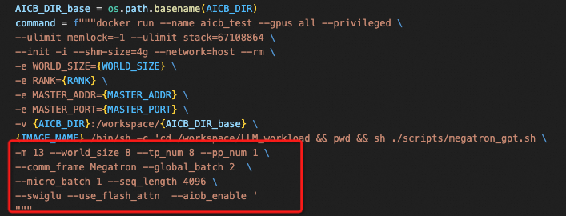

# Introduction
AI Communication Benchmark is a specialized communication benchmarking suite designed for artificial intelligence (AI) scenarios, primarily used to evaluate the performance of communication stacks. This suite not only provides detailed performance metrics but also assists developers in quickly identifying and diagnosing potential performance bottlenecks and issues within the communication stack. By simulating real-world communication traffic patterns during AI training and inference processes, this benchmark accurately reflects the communication stack's actual performance under conditions of high concurrency and large data transfer volumes. Whether it's inter-node communication in distributed computing or data synchronization in large-scale model training, this benchmarking suite offers effective performance evaluation and optimization recommendations to help users enhance overall system efficiency and stability.
简介  
AI 通信基准 (AI Communication Benchmark) 是一套专门为人工智能 (AI) 场景设计的通信基准测试套件，主要用于评估通信栈的性能。  
该套件不仅提供详细的性能指标，还帮助开发人员快速识别和诊断通信栈中的潜在性能瓶颈和问题。  
通过在 AI 训练和推理过程中模拟真实的通信流量模式，该基准测试能够准确反映通信栈在高并发和大数据传输量条件下的实际性能。  
无论是分布式计算中的节点间通信，还是大规模模型训练中的数据同步，此基准测试套件都能提供有效的性能评估和优化建议，帮助用户提高整体系统效率和稳定性。  

# Environment Setup
Before setting up the environment, first pull the code repository to your local machine and then proceed with the environment configuration:
环境配置  
在配置环境之前，先将代码库克隆到本地计算机，然后进行环境配置：  

```
git clone https://github.com/aliyun/aicb.git
```
For the environment, if you are only generating workloads, no additional dependencies are needed. However, other functionalities require dependencies such as PyTorch, CUDA, NCCL, and NVIDIA APEX. Therefore, you can set up an appropriate runtime environment either by configuring your local environment or using Docker.
如果您只需要生成工作负载，则无需额外的依赖项。  
但是，其他功能需要依赖如 PyTorch、CUDA、NCCL 和 NVIDIA APEX 等组件。  
因此，可以通过配置本地环境或使用 Docker 来设置适当的运行时环境。  

## Setting the environment using a Dockerfile.
使用 Dockerfile 设置环境  

```
docker build -t aicb:v0.0.1 .
docker run --gpus all --net host --shm-size 16g -it --rm aicb:v0.0.1 
```

## Setting the Environment Locally
For a local environment, you will need Python >= 3.8, CUDA Version >= 11.8, PyTorch >= 2.0.0, and NVIDIA APEX.
在本地环境中设置  
在本地环境中，您需要 Python >= 3.8、CUDA 版本 >= 11.8、PyTorch >= 2.0.0 和 NVIDIA APEX。  


 nvcc -V
Cuda compilation tools, release 12.4, V12.4.131
Build cuda_12.4.r12.4/compiler.34097967_0
>>> print(torch.__version__)
2.5.1+cu124

## Using Official Docker
You can also create the required Docker environment using [NGC's PyTorch container ](https://ngc.nvidia.com/catalog/containers/nvidia:pytorch), where pytorch:xx.xx should be >= pytorch:23.08.
使用官方 Docker  
您还可以使用 [NGC 的 PyTorch 容器](https://ngc.nvidia.com/catalog/containers/nvidia:pytorch) 来创建所需的 Docker 环境，其中 pytorch:xx.xx 应该 >= pytorch:23.08。  

```
docker pull nvcr.io/nvidia/pytorch:xx.xx-py3
docker run --gpus all -it --rm -v /path/to/AICBench:/workspace/AICBench nvcr.io/nvidia/pytorch:xx.xx-py3
```

docker pull nvcr.io/nvidia/pytorch:23.08-py3
docker run --gpus all -it --rm -v /path/to/AICBench:/workspace/AICBench nvcr.io/nvidia/pytorch:23.08-py3

docker ps
dokcer stop [CONTAINER_ID或NAME] 
dokcer stop my-nginx


# Basic Usage 基本用法 
## Physical Execution 物理机运行  
When running on a physical machine, additional configuration for PyTorch-related environment variables is required. This can be done by explicitly specifying them in a script or by adding the environment variables directly. The following table lists the required environment variables:
在物理机上运行时，需要为与 PyTorch 相关的环境变量进行额外配置。  
这可以通过在脚本中显式指定环境变量，或者直接添加这些环境变量来完成。  
以下表格列出了所需的环境变量：  


| Parameter Name  | Description                   |
|-----------------|-------------------------------|
| nnodes          | Number of nodes               |
| node_rank       | Rank number of the node       |
| nproc_per_node  | Number of GPUs per node       |
| master_addr     | Address of the master node    |

| 参数名称          | 描述                          |  
|------------------|------------------------------|  
| nnodes           | 节点数量                      |  
| node_rank        | 当前节点的排名                |  
| nproc_per_node   | 每个节点的 GPU 数量           |  
| master_addr      | 主节点地址                    |  


### Quick start for single-node execution 单节点快速启动  
The script for running AICB on a physical machine is：在物理机上运行 AICB 的脚本为：[/scripts/megatron_workload_with_aiob.sh](../scripts/megatron_workload_with_aiob.sh)

We provide four pre-existing models (7/13/22/175/)B and moe to quickly launch and run on a physical machine, which can be specified using the parameter `--model_size`. Additionally, the Megatron parallel framework supports enabling the aiob_enable option to obtain the computation time for each operation of the actual model. Without using aiob, only fixed waiting times can be filled. Alternatively, when AIOB is enabled, you can specify `--comp_filepath` to fill in the corresponding computation time.
我们提供了四种预定义模型 (7/13/22/175/)B 和 moe，可以快速在物理机上启动和运行，  
可以通过参数 `--model_size` 指定模型大小。此外，Megatron 并行框架支持启用 `aiob_enable` 选项来获取实际模型每个操作的计算时间。  
如果不使用 aiob，则只能填充固定的等待时间。或者，当启用 AIOB 时，可以通过指定 `--comp_filepath` 填充对应的计算时间。 

Below is an example of generating a Workload with a model size of 13B, tp 8, pp 1, a total GPU count of 8, gbs 2, mbs 1, sequence length of 4096, with flash_attn and swiglu enabled, and using AIOB to obtain the computation time for each operation of the actual model.
以下是生成工作负载的示例，使用模型大小为 13B，张量并行度为 8，流水线并行度为 1，总 GPU 数量为 8，全局批量大小为 2，微批量大小为 1，序列长度为 4096，  
同时启用 `flash_attn` 和 `swiglu`，并使用 AIOB 获取实际模型每个操作的计算时间：  

``` bash
export MASTER_ADDR=127.0.0.1
export MASTER_PORT=23089
export WORLD_SIZE=1
export RANK=0


sh ./scripts/megatron_gpt.sh \
-m 13 --world_size 8 --tensor_model_parallel_size 8 --pipeline_model_parallel 1 \
--frame Megatron --global_batch 2  \
--micro_batch 1 --seq_length 4096 \
--swiglu --use_flash_attn  --aiob_enable  
```

pip install apex
conda activate /root/anaconda3/envs/vllm_py310

``` bash
export MASTER_ADDR=127.0.0.1
export MASTER_PORT=23089
export WORLD_SIZE=1
export RANK=0


sh ./scripts/megatron_gpt.sh \
-m 13 --world_size 4 --tensor_model_parallel_size 4 --pipeline_model_parallel 1 \
--frame Megatron --global_batch 2  \
--micro_batch 1 --seq_length 4096 \
--swiglu --use_flash_attn  --aiob_enable  
```

```bash
export MASTER_ADDR=127.0.0.1  # 设置主节点地址为127.0.0.1
export MASTER_PORT=23089      # 设置主节点端口为23089
export WORLD_SIZE=1           # 设置全局的节点数量为1
export RANK=0                 # 设置当前节点的排名为0

sh ./scripts/megatron_gpt.sh \  # 运行 Megatron GPT 的脚本
-m 13 \                        # 设置模型大小为13B
--world_size 8 \               # 设置总 GPU 数量为8
--tensor_model_parallel_size 8 \ # 设置张量模型并行大小为8
--pipeline_model_parallel 1 \    # 设置流水线模型并行大小为1
--frame Megatron \              # 使用 Megatron 框架
--global_batch 2 \              # 设置全局批量大小为2
--micro_batch 1 \               # 设置微批量大小为1
--seq_length 4096 \             # 设置序列长度为4096
--swiglu \                      # 启用 Swiglu 激活函数
--use_flash_attn \              # 启用 Flash Attention
--aiob_enable                   # 启用 AIOB 以获取计算时间
```


### Quick start for multi-node execution 多节点快速启动
The script used for multi-node execution is：用于多节点执行的脚本是 [run_in_cluster.py](../scripts/run_in_cluster.py)

Steps：
1. First, install the batch distribution commands (such as pssh and pscp).
2. Edit the `iplist` file of the cluster to be used, adding an accessible IP address of each machine per line to the iplist.
3. Modify [run_in_cluster.py](../scripts/run_in_cluster.py) to specify the image name and paths to `iplist` file and AICB home directory. Please refer to the doc of [run_in_cluster.py](../scripts/run_in_cluster.py) for more details. 
4. Modify [run_suites.py](../run_suites.py) to select the workload to run (default: no workload).
5. Copy the `iplist` and AICB source code to each machine (e.g., using pscp).
6. Run the command just like this: `pssh -i -h /path/to/iplist -o out -e err -t 0 "cd /path/to/aicb && python run_in_cluster.py"`. Remember to replace `/path/to/iplist` and `/path/to/aicb` with the actual path on your machine.

步骤：  
1. 首先，安装批量分发命令工具（如 pssh 和 pscp）。  
2. 编辑要使用的集群的 `iplist` 文件，在文件中每行添加一台机器的可访问 IP 地址。  
3. 修改 [run_in_cluster.py](../scripts/run_in_cluster.py) 以指定镜像名称，以及 `iplist` 文件和 AICB 主目录的路径。详细信息请参考 [run_in_cluster.py](../scripts/run_in_cluster.py) 的文档。  
4. 修改 [run_suites.py](../run_suites.py) 以选择要运行的工作负载（默认：无工作负载）。  
5. 将 `iplist` 和 AICB 源代码复制到每台机器上（例如，使用 pscp）。  
6. 使用以下命令运行程序：  
   ```bash
   pssh -i -h /path/to/iplist -o out -e err -t 0 "cd /path/to/aicb && python run_in_cluster.py"
   ```
   请将 `/path/to/iplist` 和 `/path/to/aicb` 替换为您机器上的实际路径。  

The specific command to be run on each machine can be modified in the highlighted section: 在每台机器上运行的具体命令可以在脚本的高亮部分进行修改：  



### Logs and Results 日志与结果
After each communication is completed, the program will print the relevant logs for this communication. The output format is as follows and contains almost all the information about the communication operation:
* communication type
* communication group
* Message size
* Communication execution time
* [Throughput](https://github.com/NVIDIA/nccl-tests/blob/master/doc/PERFORMANCE.md)

每次通信完成后，程序会打印此次通信的相关日志。输出格式如下，并包含几乎所有关于通信操作的信息：  
- 通信类型  
- 通信组  
- 消息大小  
- 通信执行时间  
- [吞吐量](https://github.com/NVIDIA/nccl-tests/blob/master/doc/PERFORMANCE.md)  


After all communications are completed, information about the use case will be summarized.
* This includes the overall runtime and an analysis of the time for each iteration, allowing for a clear view of whether each iteration runs normally and if there are any jitters.
所有通信完成后，会汇总用例信息：  
- 包括整体运行时长以及每次迭代的时间分析，便于清晰查看每次迭代是否正常运行以及是否存在抖动问题。  


* Time for each communication type
First, distinguish between the model training phases: the init phase and the train phase. Then, summarize the collective communications performed in each phase, including their corresponding message sizes, frequencies, and specific average latencies, maximum and minimum values, etc. This helps to pinpoint which type of collective communication operation in which message segment is causing anomalies, facilitating further investigation and troubleshooting.
- 每种通信类型的时间：  
  首先区分模型训练阶段：初始化阶段和训练阶段。然后总结每个阶段执行的通信操作，包括对应的消息大小、频率，以及具体的平均延迟、最大值和最小值等信息。这有助于定位在哪个消息段的哪种通信操作中出现了异常，便于进一步排查和解决问题。  

#### File outputs 文件输出  
The file outputs include two different types of files: .csv file.
文件输出包括两种不同类型的文件：`.csv` 文件。  
1. The CSV files are saved in: CSV 文件保存在：  
`results/comm_logs/megatron_gpt_13B_8n_log.csv`,And you can also see the execution time, the execution phase, as well as the algorithmic bandwidth (algbw) and bus bandwidth (busbw) belonging to different comm_group and different comm_type.It also includes the computation time for each part of the model and the computation phase it belongs to.
您还可以查看执行时间、执行阶段，以及不同通信组和通信类型对应的算法带宽 (algbw) 和总线带宽 (busbw)。还包括模型每部分的计算时间及其所属的计算阶段。  


Inaddition to the aforementioned details, a .csv file is provided for detailed analysis of the results. Here’s how to work with it:
除了上述详细信息，还提供 `.csv` 文件用于结果的详细分析。以下是操作方法：  
    1. Reading _workload.csv Log:
      * You can read the _workload.csv log file by invoking log_analyzer.log.Workload.load(filename).
      * This will return Workload and args.
        * args contains the parameters used for training input.
        * Workload consists of the generated intermediate results.
    2. Reading _log.csv Log:
    * You can read the _log.csv log file by invoking log_analyzer.log.Log.load(filename).
    * This will return a Log object, containing:
      * comm_logs: List[LogItem]: This is a list of all generated logs.
      * epoch_times: List[int]: This lists the time taken for each iteration. The first iteration typically represents initialization, which might show different communication behavior compared to subsequent iterations, potentially leading to differences in time.
      * comm_log_each_epoch: List[List[LogItem]]: This is a list where each item corresponds to the communication logs for each iteration. If one iteration has a significantly different time compared to others, you can analyze this specific iteration to identify the communication causing the discrepancy.
By leveraging these log files and parsing methods, you can perform a thorough and detailed analysis of the training process, identifying any abnormalities or areas for optimization.
    1. 读取 `_workload.csv` 日志：  
      - 通过调用 `log_analyzer.log.Workload.load(filename)` 读取 `_workload.csv` 日志文件。  
      - 这将返回 `Workload` 和 `args`：  
        - `args` 包含用于训练输入的参数。  
        - `Workload` 包括生成的中间结果。 
    2. 读取 `_log.csv` 日志：  
      - 通过调用 `log_analyzer.log.Log.load(filename)` 读取 `_log.csv` 日志文件。  
      - 这将返回一个 `Log` 对象，包含：  
        - `comm_logs: List[LogItem]`：这是生成的所有日志项的列表。  
        - `epoch_times: List[int]`：列出每次迭代所用的时间。通常，第一轮迭代代表初始化，可能与后续迭代的通信行为不同，从而导致时间差异。  
        - `comm_log_each_epoch: List[List[LogItem]]`：这是一个列表，其中每项对应于每次迭代的通信日志。如果某次迭代的时间与其他迭代显著不同，可以分析该特定迭代，找出导致时间差异的通信问题。  

通过这些日志文件和解析方法，您可以对训练过程进行深入而详细的分析，识别任何异常或优化空间。  

## Generate Workload for Simulation(SimAI) 为模拟生成工作负载 (SimAI)  
### Quick start 快速启动  
AICB's script for generating Workload is:用于生成工作负载的 AICB 脚本是： `./scripts/megatron_workload_with_aiob.sh`
We provide four pre-existing models (7/13/22/175)B to quickly generate the corresponding Workload, which can be specified using the parameter `--model_size`.The computation part of the model can be selected to use aiob via--aiob_enableWhen not using aiob, the default fixed time is used to fill the Workload.When `--aiob_enable` is enabled, if `--comp_filepath` is not specified, the current GPU's computation time will be used to fill the Workload
Below is an example of generating a Workload with a model size of 7B, tp 4, pp 1, a total GPU count of 4096, gbs 8192, mbs 1, sequence length of 4096, with flash_attn, swiglu, and aiob enabled, and reading Example.txt as the computation time.

我们提供了四种预定义模型 (7/13/22/175)B，用于快速生成对应的工作负载，可通过参数 `--model_size` 指定。  
模型的计算部分可以通过 `--aiob_enable` 启用 aiob。若未使用 aiob，默认填充固定时间到工作负载中。启用 `--aiob_enable` 时，若未指定 `--comp_filepath`，则会使用当前 GPU 的计算时间填充工作负载。  
以下是生成工作负载的示例：使用模型大小 7B，张量并行度 4，流水线并行度 1，总 GPU 数量为 4096，全局批量大小为 8192，微批量大小为 1，序列长度为 4096，启用 `flash_attn`、`swiglu` 和 aiob，并读取 `Example.txt` 作为计算时间：  

```bash
sh ./scripts/megatron_workload_with_aiob.sh -m 7 \
--world_size 4096 --tensor_model_parallel_size 4 --pipeline_model_parallel 1 \
--frame Megatron --global_batch 8192 \
--micro_batch 1 --seq_length 4096 --swiglu \
--use_flash_attn  --aiob_enable \
--comp_filepath workload/aiob_inputs/Example.txt
```

### Workload 工作负载  
The generated Workload result is saved in:生成的工作负载结果保存在: `results/workload/gpt_7B-world_size4096-tp4-pp1-gbs8192-mbs1-seq4096-flash_attn-True.txt`


## Run AICB with customized cases 使用自定义用例运行 AICB  
In addition to the quick start options, you can also customize the model parameters in detail to run on physical machines or generate the required workloads for simulation and analysis. This flexibility allows you to tailor the workloads specifically to your needs, whether you are experimenting with different configurations of large language models, testing various parallel frameworks, or optimizing your runtime environment. Customizing parameters provides deeper insights and greater control over the benchmarking and simulation processes, enabling more precise performance tuning and analysis.
除了快速启动选项，您还可以详细自定义模型参数，在物理机上运行，或生成所需的工作负载用于模拟和分析。  
这种灵活性允许您根据需求调整工作负载，无论是试验不同的大语言模型配置、测试各种并行框架，还是优化运行环境。  
通过自定义参数，可以更深入地了解性能并精确调整，以进行高效的基准测试和模拟分析。

### Parameters 参数说明 
The main parameters for AICB are as follows: AICB 的主要参数如下：  


| 分类                         | 参数名称                         | 描述                                                                       |  
|------------------------------|----------------------------------|---------------------------------------------------------------------------|  
| **名称**                    | frame                           | 使用的框架（DeepSpeed/Megatron）                                           |  
|                              | model_name                      | 模型名称（如 Llama、GPT 等）                                               |  
| **训练参数**                  | world_size                      | 总 GPU 数量                                                                |  
|                              | global_batch                    | 训练的全局批量大小                                                         |  
|                              | micro_batch                     | 每个模型实例的批量大小（本地批量大小）                                      |  
|                              | epoch_num                       | 迭代次数                                                                   |  
| **模型参数**                  | model_size                      | 模型大小（7/13/65/175/270）B 或 MoE                                        |  
|                              | num_layers                      | Transformer 层数                                                           |  
|                              | hidden_size                     | Transformer 的隐藏层大小                                                   |  
|                              | num_attention_heads             | Transformer 的注意力头数量                                                 |  
|                              | seq_length                      | 最大处理序列长度                                                           |  
|                              | vocab_size                      | 在 EOD 或填充之前的词汇表大小                                               |  
|                              | max_position_embeddings         | 使用的最大位置嵌入数量                                                     |  
|                              | ffn_hidden_size                 | Transformer 前馈网络（FFN）的隐藏层大小                                     |  
| **Megatron 并行参数**         | tensor_model_parallel_size      | 张量模型并行度                                                             |  
|                              | pipeline_model_parallel         | 流水线模型并行度                                                           |  
|                              | enable_sequence_parallel        | 启用序列并行优化                                                           |  
| **Megatron 优化参数**         | use_flash_attn                  | 使用 FlashAttention 的注意力实现                                            |  
|                              | swiglu                          | 使用门控线性单元和 SiLU 激活代替默认的 GELU                                 |  
|                              | openai_gelu                     | 使用 OpenAI 的 GELU 实现                                                    |  
|                              | onnx_safe                       | 处理 Torch ONNX 导出器已知问题的解决方法                                    |  
|                              | squared_relu                    | 使用平方 ReLU 激活代替默认的 GELU                                           |  
|                              | bias_gelu_fusion                | 启用 bias 和 GELU 融合                                                     |  
|                              | gated_linear_unit               | 在使用 swiglu 时启用                                                       |  
| **MoE 参数**                 | expert_model_parallel_size      | 专家模型的并行度                                                           |  
|                              | moe_enable                      | 启用 MoE                                                                   |  
|                              | num_experts                     | MoE 中的专家数量（None 表示未启用 MoE）                                      |  
|                              | moe_router_topk                 | 每个 token 路由的专家数量                                                  |  
|                              | moe_grouped_gemm                | 当每个节点上有多个专家时，将多个本地（可能较小）的 GEMM 合并到单个内核中      |  
| **DeepSpeed 参数**            | zero_stage, reduce_bucket_size  | 选择 Zero 优化器阶段                                                       |  
|                              | allgather_bucket_size           | 优化 all-gather 操作期间的通信效率和内存使用（仅适用于阶段 1/2）             |  
|                              | prefetch_bucket_size, param_persistence_threshold, model_persistence_threshold, max_live_parameters | 仅适用于阶段 3。控制预取参数的数量及 all_gather 和 reduce_scatter 的大小 |  
| **其他**                     | aiob_enable                     | 启用 AIOB 获取计算时间                                                     |  
|                              | comp_filepath                   | 使用 aiob_lib 获取操作的计算时间                                            |  

---


### Running on physical GPU clusters
The current entry file for running custom cases is [aicb.py](../aicb.py). By using this file, you can flexibly choose more parameters for tuning.
 在物理 GPU 集群上运行  
当前用于运行自定义用例的入口文件是 [aicb.py](../aicb.py)。通过该文件，您可以灵活选择更多参数进行调优。  

```bash
# DeepSpeed Stage 2 Example **DeepSpeed Stage 2 示例**   
torchrun \
--nnodes ${WORLD_SIZE} \
--node_rank ${RANK} \
--nproc_per_node gpu \
--master_addr ${MASTER_ADDR} \
--master_port ${MASTER_PORT} \
./aicb.py --frame=DeepSpeed --stage=$stage \
--world_size=$((NNODES*8)) --global_batch=$global_batch --epoch_num=$epoch_num \
--num_layers=$num_layers --hidden_size=$hidden_size \
--ffn_hidden_size=$ffn_hidden_size --num_attention_heads=$attention_heads \
--reduce_bucket_size=$bucket_size --allgather_bucket_size=$bucket_size

# Megatron Example **Megatron 示例**  
torchrun \
--nnodes $WORLD_SIZE \
--node_rank $RANK \
--nproc_per_node gpu \
--master_addr $MASTER_ADDR \
--master_port $MASTER_PORT \
./aicb.py --frame=Megatron --world_size=$((WORLD_SIZE*8)) --tensor_model_parallel_size=$tensor_model_parallel_size \
  --micro_batch=$batch_size --global_batch=$((WORLD_SIZE*8*batch_size/tensor_model_parallel_size)) --epoch_num=$epoch_num --swiglu \
  --num_layers=$num_layers --hidden_size=$hidden_size --ffn_hidden_size=$ffn_hidden_size --num_attention_heads=$num_attention_heads \
  $sp_enable --seq_len=$seq_len --vocab_size=$vocab_size --aiob_enable=$enable 

# MoE Example **MoE 示例**  
torchrun \
--nnodes $WORLD_SIZE \
--node_rank $RANK \
--nproc_per_node gpu \
--master_addr $MASTER_ADDR \
--master_port $MASTER_PORT \
./aicb.py --frame=Megatron --world_size=$((WORLD_SIZE*8)) --tensor_model_parallel_size=$tensor_model_parallel_size --expert_model_parallel_size=$expert_model_parallel_size \
--moe_enable=$moe_enable --num_experts=$num_experts --moe_router_topk=$moe_router_topk --moe_grouped_gemm=$moe_grouped_gemm \
  --micro_batch=$batch_size --global_batch=$((WORLD_SIZE*8*batch_size/tensor_model_parallel_size)) --epoch_num=$epoch_num --swiglu \
  --num_layers=$num_layers --hidden_size=$hidden_size --ffn_hidden_size=$ffn_hidden_size --num_attention_heads=$num_attention_heads \
  $sp_enable --seq_len=$seq_len --vocab_size=$vocab_size --aiob_enable=$enable 
```
### Generating Workloads 生成工作负载 
In AICB, the generation of Workloads is divided into two types: one is to generate Workloads that can be used for simulation and analysis, and the other is to generate general-purpose Workloads that contain detailed information about various communication and computation aspects.
By providing the detailed parameters of the model, you can generate a general-purpose Workload that includes detailed information about various communications and computations. The general-purpose workload allows you to analyze the model's computational and communication performance under different parameters, and customize the workload files for run-time tuning and optimization. This can be achieved by using the following files:
[generate_deepspeed_stage3_workload](../workload_generator/generate_deepspeed_stage3_workload.py),[generate_deepspeed_stage1_2_workload](../workload_generator/generate_deepspeed_stage1_2_workload.py),[generate_megatron_workload](../workload_generator/generate_megatron_workload.py)

在 AICB 中，工作负载的生成分为两种类型：一种是用于模拟和分析的工作负载，另一种是包含各种通信和计算详细信息的通用工作负载。
通过提供模型的详细参数，您可以生成通用工作负载，其中包含关于各种通信和计算的详细信息。通用工作负载可以让您分析模型在不同参数下的计算和通信性能，并自定义工作负载文件以进行运行时调优和优化。
可以使用以下文件完成这些操作：
generate_deepspeed_stage3_workload、
generate_deepspeed_stage1_2_workload、
generate_megatron_workload

Here is an example: 以下是一个示例：
```bash
python -m workload_generator.AIOB_simAI_workload_generator \
  --model_name GPT-13B --frame=Megatron \
  --world_size=16 --tensor_model_parallel_size=2 --pipeline_model_parallel=1 --global_batch=16 \
  --micro_batch=1   --num_layers=40 --seq_length=2048 \
  --hidden_size=5120 --epoch_num=1 \
  --use-distributed-optimizer --num_attention_heads=40 \
  --aiob_enable --use_flash_attn --swiglu 
```
#### Workload Files
The generated Workload files are saved in the `results/mocked_workload` directory.
Here is an explanation of a the generated Workload file:
工作负载文件
生成的工作负载文件保存在 results/mocked_workload 目录中。
以下是生成的工作负载文件的说明：


### Creating customized Models
AICB offers remarkable extensibility. In addition to supporting GPT and LLaMA series models, it also allows for the creation of workloads for custom model architectures. This flexibility means you can adapt AICB to generate and test communication and computation patterns for a wide variety of models, beyond the pre-configured options, making it an invaluable tool for benchmarking and optimizing diverse AI training frameworks.
Custom models can be built using the MockedParam and MockedModel base classes. For specific implementation details, you can refer to the existing MockedMegatron and MockedDeepSpeed implementations.

Here is an example of a DeepSpeed Llama model:

创建自定义模型
AICB 提供了极大的扩展性。除了支持 GPT 和 LLaMA 系列模型，还允许为自定义模型架构创建工作负载。这种灵活性意味着您可以调整 AICB 来生成和测试各种模型的通信和计算模式，超越预配置选项，使其成为基准测试和优化各种 AI 训练框架的宝贵工具。
自定义模型可以使用 MockedParam 和 MockedModel 基类构建。有关具体实现细节，可以参考现有的 MockedMegatron 和 MockedDeepSpeed 实现。

以下是一个 DeepSpeed Llama 模型的示例：


```
DeepspeedForCausalLM
      |
      v
+----------------------+
| Linear: embed_tokens |
+----------------------+
      |
      v
+--------------------------------------+
|            DeepspeedModel            |
| +----------------------------------+ |
| | Linear: embed_tokens             | |
| +----------------------------------+ |
| | DeepspeedDecoderLayer x N        | |
| +----------------------------------+ |
| | Linear: norm                     | |
+--------------------------------------+
      |
      v
+--------------------------------------------------+
|              DeepspeedDecoderLayer               |
| +----------------------------------------------+ |
| | Linear: input_layernorm                      | |
| +----------------------------------------------+ |
| | DeepspeedAttention                           | |
| |  +----------------------------------------+  | |
| |  | Linear: q_proj                         |  | |
| |  | Linear: k_proj                         |  | |
| |  | Linear: v_proj                         |  | |
| |  | Linear: o_proj                         |  | |
| |  +----------------------------------------+  | |
| +----------------------------------------------+ |
| | Linear: post_attn_norm                      | |
| +----------------------------------------------+ |
| | DeepspeedMLP                                | |
| |  +----------------------------------------+  | |
| |  | Linear: gate_proj                       |  | |
| |  | Linear: down_proj                       |  | |
| |  | Linear: up_proj                         |  | |
| |  +----------------------------------------+  | |
+--------------------------------------------------+
      |
      v
+----------------------+
| Linear: lm_head      |
+----------------------+

```

Besides Model, you alse need to mocked the entire training process. The training process for all frameworks is abstracted into the following steps: `init, forward, backward, and step` (excluding pipeline parallelism). We need to further elaborate on the communications that occur in each step with workload items.
In the code, each workload primarily consists of three components:
1. Communication Information:
   This primarily includes information related to collective communication activities such as `comm_type, comm_group, comm_group_size, and msg_size`.
2. Additional Information:
   This includes supplementary information, such as the source node for broadcast communications and the time for compute operations.
3. Runtime Information:
   This mainly consists of runtime-specific details like `elapsed_time, algo_bw, and bus_bw` which indicate the actual performance and state of the collective communication activities.
Here is a brief example of training process and workload item:

除了模型，您还需要模拟整个训练过程。所有框架的训练过程被抽象为以下几个步骤：
init, forward, backward, 和 step（不包括流水线并行）。
需要进一步阐明每个步骤中发生的通信，并通过工作负载项记录相关信息。

在代码中，每个工作负载主要由以下三部分组成：

通信信息：
主要包括集体通信活动的相关信息，如 comm_type, comm_group, comm_group_size, 和 msg_size。
附加信息：
包括补充信息，例如广播通信的源节点，以及计算操作的时间。
运行时信息：
主要包含运行时特定的详细信息，如 elapsed_time, algo_bw, 和 bus_bw，它们指示集体通信活动的实际性能和状态。
以下是训练过程和工作负载项的简要示例：


```python
trainer.init()
for _ in range(epoch_num):
    if pipeline_model_parallel > 1:
        trainer.with_pipeline_forward_backward()
    else:
        for _ in range(num_microbatches):
            trainer.forward()
            trainer.backward()
    trainer.step()
workload.append({
    "operation": "init",             # Corresponds to one of init, forward, backward, step
    "comm_type": CommType.broadcast, # The type of communication
    "call_func": "_broadcast_model", # The function invoked in the source code
    "msg_size": param.msg_size(),    # The size of the communication message
    "comm_group": CommGroup.dp_group,# The communication group
    "src": 0,                        # Optional: Only for broadcast, specifies the source node
    "additional": send_next          # Optional: Specifies the corresponding operation in pipeline parallelism
})
```

```python
trainer.init()
for _ in range(epoch_num):
    if pipeline_model_parallel > 1:
        trainer.with_pipeline_forward_backward()
    else:
        for _ in range(num_microbatches):
            trainer.forward()
            trainer.backward()
    trainer.step()
workload.append({
    "operation": "init",             # 对应于 init, forward, backward, step 中的一种操作
    "comm_type": CommType.broadcast, # 通信类型
    "call_func": "_broadcast_model", # 源代码中调用的函数
    "msg_size": param.msg_size(),    # 通信消息的大小
    "comm_group": CommGroup.dp_group,# 通信组
    "src": 0,                        # 可选：仅用于广播，指定源节点
    "additional": send_next          # 可选：指定流水线并行中的相应操作
})
```

# Troubleshooting & FAQs 故障排除 & 常见问题 
N/A

